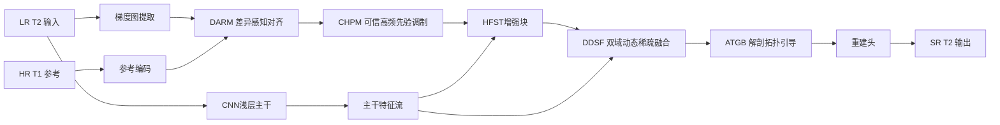

# 创新结合报告3

## 一、基座

HSFT优点：

- **有公开代码**：论文正文已明确给出代码仓库：`https://github.com/dummerchen/HFST`，后续复现、改模块、做消融都更方便。
- **结构叙事更强**：HFST 本身就围绕“高频结构先验 + 模态内/跨模态结构关系 + Transformer”展开，很适合继续往“可信高频、错位鲁棒、双域融合”方向深化。

---

## 二、HFST 的核心优点

HFST 的主干思路本身是成立的，适合作为创新出发点：

- 用 **LR T2 的梯度图** 提取模态内高频结构先验；
- 用 **HR T1** 提供跨模态结构先验；
- 在 HFST 模块中并行建模 **intra-modality** 与 **inter-modality** 关系；
- 用窗口注意力和 head 内 / head 间相关性增强结构关系提取；
- 在 IXI、BraTS2018、fastMRI 上效果较强，论文说服力比较足。

所以，HFST 不是“方向不对”，而是**还可以继续补齐真实场景中的几个关键短板**。

---

## 三、HFST 当前的不足

HFST 主要有下面 4 个不足：

### 1）默认参考模态可直接利用，对错位问题考虑不够

HFST 依赖 HR T1 给 LR T2 提供结构先验，但论文主线并没有像 `MAR-DUN` 那样显式处理 **跨模态错位**。  
这在真实临床场景里是风险点：轻微位移、头动、切片差异都会让参考模态结构“借错地方”。

### 2）参考结构先验缺少“可信度控制”

HFST 虽然利用了梯度图和 T1 结构先验，但整体上还是偏“直接增强结构”。  
它没有像 `HFMT`、`Fine-Grained Difference Learning`、`MFSD` 那样显式回答：

- 哪些参考高频是可信的；
- 哪些区域其实和目标模态差异很大；
- 哪些低频 / 弱相关信息应该被压制。

这意味着它**容易把参考模态的错误边缘、无关纹理、甚至病灶不一致信息带进目标模态**。

### 3）高频先验主要来自梯度域，频率域建模还不够完整

HFST 采用梯度图做高频结构先验，这样做简单有效，但也有局限：

- 梯度对边缘敏感，但对复杂纹理频带表达不够完整；
- 噪声也容易在梯度域被放大；
- 对不同强度区域的高频恢复不够细粒度。

而 `DMASR`、`CAFET`、`Dual-space High-frequency Learning` 这几篇论文都说明：  
**仅有空间/梯度高频还不够，最好再配合显式频率域或双域高频增强。**

### 4）窗口注意力更擅长局部结构，解剖拓扑关系仍可加强

HFST 的窗口注意力对局部结构恢复有效，但对更长距离的解剖一致性、区域间拓扑关系建模仍然偏弱。  
`GraphMSR` 的启发就在这里：MRI 结构不是普通自然图像纹理，很多恢复错误其实是 **解剖关系没建好**。

---

## 四、借鉴其它论文优势

下面这些论文最适合给 HFST 补短板：

### 1）`MAR-DUN`
- **优势**：IDL 逆变形对齐 + CNLM 跨模态非局部建模；
- **能补 HFST 什么**：补“错位鲁棒性”。

### 2）`Bridging MRI Cross-Modality Synthesis and Multi-Contrast SR by Fine-Grained Difference Learning`
- **优势**：细粒度差异建模、差异正则、增量调制；
- **能补 HFST 什么**：补“参考结构不是全都能借”的差异感知逻辑。

### 3）`HFMT`
- **优势**：只强调和提纯高频先验，再做跨注意融合；
- **能补 HFST 什么**：补“高频先验可信增强与受控注入”。

### 4）`DMASR`
- **优势**：空间域 + 频率域双域稀疏融合，且关注不同强度区域；
- **能补 HFST 什么**：补“梯度域不够完整”的双域融合问题。

### 5）`CAFET`
- **优势**：高频增强块 + 自适应稀疏重叠注意，能过滤冗余信息；
- **能补 HFST 什么**：补“窗口注意力的信息冗余与跨窗口交互不足”。

---

## 五、创新主线

### 创新主线名称

**面向错位鲁棒与可信高频迁移的双域拓扑增强 HFST**

英文名可写成：

**TR-DCT-HFST**  
`Topology-enhanced, Registration-aware, Dual-domain Credible Transfer HFST`

### 一句话概括

在 HFST 的“梯度高频结构先验 + 跨模态结构先验”基础上，引入：

- **错位鲁棒对齐**
- **差异感知可信高频迁移**
- **空间-频率双域稀疏融合**
- **解剖拓扑约束**

把 HFST 从“结构增强型 Transformer”升级成“**真实场景更稳、参考注入更准、解剖结构更可信**”的多模态 MRI 超分框架。

---

## 六、具体怎么改：建议做成 4 个增强模块

### 1）DARM：Difference-Aware Registration Module

先在 HFST 前面加入 **差异感知对齐模块 DARM**：

- 用 `MAR-DUN` 的 **IDL** 思路做目标 / 参考特征柔性对齐；
- 再借鉴 `Fine-Grained Difference Learning` 估计 **结构差异图**；
- 用差异图指导后续参考信息注入强度。

这样做的好处是：

- 先解决“位置对不对”；
- 再解决“内容该不该借”。

这比 HFST 直接拿参考结构先验更稳。

### 2）CHPM：Credible High-frequency Prior Modulation

在原 HFST 的结构先验支路中加入 **可信高频先验调制模块 CHPM**：

- 借 `HFMT` 的思想，先从目标模态与参考模态中提纯高频；
- 借 `MFSD` 的 LFIF 思想，抑制参考模态低频冗余；
- 结合差异图和相似性图生成 **高频置信度图**；
- 只让高置信参考高频参与融合。

它解决的是 HFST 当前最危险的问题：  
**参考模态不是不能用，而是不能不分青红皂白地用。**

### 3）DDSF：Dual-domain Dynamic Sparse Fusion

把 HFST 的结构融合部分升级成 **双域动态稀疏融合 DDSF**：

- 空间域：保留 HFST 原有结构关系建模；
- 频率域：引入 `DMASR` 的双域注意和 `CAFET` 的稀疏注意思想；
- 在不同强度区域做分组或分区注意，减少低价值注意连接；
- 融合时采用动态门控，而不是固定拼接。

这一步的作用是：

- 让高频恢复不只依赖梯度；
- 让跨窗口交互更有效；
- 让融合更“稀疏、准、稳”。

---

## 七、改进后整体网络结构图

---

## 八、这个创新点相对原始 HFST 的提升逻辑

### 原始 HFST

- 有高频结构先验；
- 有跨模态先验；
- 有 Transformer 关系建模；
- 但默认参考较可靠、对齐较理想、结构迁移较安全。

### 改进后

- **DARM**：解决“先对齐再融合”；
- **CHPM**：解决“先判断可信度再注入高频”；
- **DDSF**：解决“只靠梯度域不够、注意连接太密”的问题；
- **ATGB**：解决“局部细节好了但整体解剖未必合理”的问题。

所以新的主线比原始 HFST 更像一个完整论文故事：

> **从结构先验增强，升级为面向真实临床场景的可信结构迁移与解剖一致性重建。**

---

## 九、预期实验设计

### 1）基线

- Baseline：原始 `HFST`

### 2）逐步消融

1. `HFST + DARM`
2. `HFST + DARM + CHPM`
3. `HFST + DARM + CHPM + DDSF`
4. `HFST + DARM + CHPM + DDSF + ATGB`（Full）

### 3）重点验证指标

- PSNR
- SSIM
- NMSE / RMSE（如果数据集设置允许）
- 边缘区域局部放大对比
- 病灶或组织边界区域可视化

### 4）建议新增可解释可视化

- 差异图
- 对齐场 / 形变场
- 高频置信度图
- 空间域 / 频率域注意热图
- 解剖拓扑分支的节点连接可视化

---

## 十、如果只做一个“最稳、最像论文创新”的版本

如果你后续想控制工作量，我建议优先级按下面来：

### 第一优先级

**HFST + DARM + CHPM**

原因：

- 这两块最直接击中 HFST 的两个核心短板：  
  **错位问题** 和 **参考高频误迁移问题**；
- 创新叙事已经足够完整；
- 相比一次性引入图分支，工程难度更低。

### 第二优先级

再加入 **DDSF**

原因：

- 能进一步把论文从“结构先验增强”升级成“空间-频率双域增强”；
- 更容易在实验表里体现性能提升。

### 第三优先级

最后再尝试 **ATGB**

原因：

- 这是拉高论文层次感的模块；
- 但实现复杂度最高，更适合作为增强版创新。

---

## 十一、最终结论

这次如果以 **HFST** 为基座，我最推荐的创新路线不是简单继续堆高频模块，而是：

> **以 HFST 为主干，融合 MAR-DUN 的错位鲁棒对齐、Fine-Grained Difference Learning 的差异建模、HFMT 的可信高频提纯、DMASR/CAFET 的双域稀疏融合，以及 GraphMSR 的解剖拓扑先验，形成一个“错位鲁棒 + 可信迁移 + 双域增强 + 拓扑一致”的新框架。**

这个路线的优点是：

- **创新动机明确**：HFST 的短板都能被一一对应补上；
- **组合来源清晰**：每个模块都能在你现有论文池中找到依据；
- **工程上可拆分**：可以按模块逐步实现；
- **论文叙事完整**：不仅追求指标，还强调真实场景鲁棒性与结构可信性。

如果后面你要继续，我建议下一步就围绕这份报告，把它进一步收缩成：

1. **论文题目候选**
2. **方法章节草稿**
3. **实验与消融计划表**

这样就能直接进入开题 / 综述 / 复现设计阶段。
